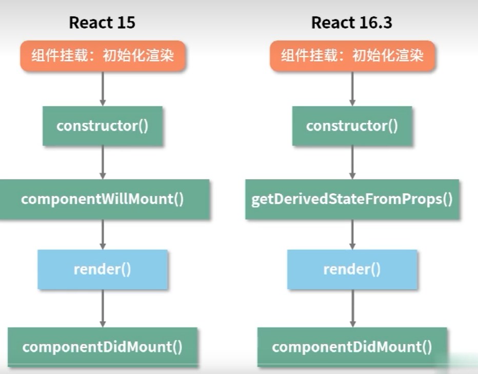
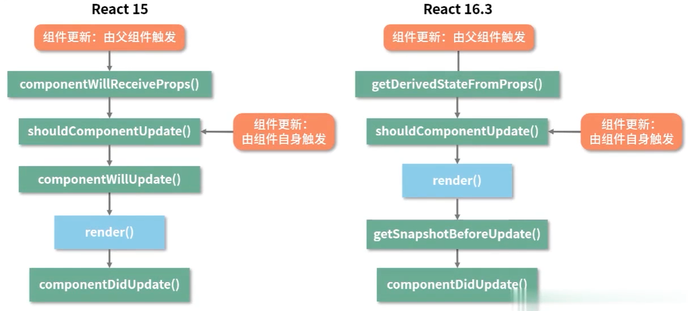

## react16生命周期改变的原因

### getDerivedStateFromProps

```js
getDerivedStateFromProps(props,state){
    return {
        text: props.text
    }
}
```

1. mounting阶段：组件的初始化渲染
   
   

   废弃了`componentWillMount`,新增了`getDerivedStateFromProps`,它不是`componentWillMount`的
   替代品。`getDerivedStateFromProps`有且只有一个用途，**使用props来更新state**，它在更新和挂载两个
   阶段都会出现。它是一个静态方法，这意味着不能在它其中去访问this。

   该方法接受两个参数props和state，同时需要一个对象格式的返回值，这个返回值对state的更新并非是覆盖式的更新，
   而是针对某个属性的定向动作。
2. updating阶段：组件的更新
   
   

   废弃了`componentWillReceiveProps`,还是使用`getDerivedStateFromProps`,与`componentDidUpdate`一起，
   这个新的生命周期涵盖了`componentWillReceiveProps`的所有用例，它可以代替`componentWillReceiveProps`
   实现基于props去更新state。**原则上getDerivedStateFromProps能做且只能做这一件事**。

### getSnapshotBeforeUpdate

```js
getSnapshotBeforeUpdate(prevProps,prevState){
    return 'hhh'
}
```

`getSnapshotBeforeUpdate`的返回值会作为第三个参数给到`componentDidUpdate`，它的执行时机是在render方法之后，真实DOM更新之前，同时获取到更新前的真是DOM和更新前后的props&state信息。

### 为什么要进行这两次变化
Fiber是React16对React核心的一次重写，Fiber会使原本同步的渲染过程变成异步的。Fiber会将一个大的更新任务拆解成
许多个小任务。

Fiber架构的重要特征就是**可以被打断的异步渲染模式**。根据能否被打断这一标准这个标准，React16的生命周期被分为
render和commit两个阶段。render阶段在执行过程中允许被打断，commit阶段总是同步执行的。

render阶段允许暂停，终止和重启，这意味着render阶段的生命周期都是有可能重复执行的。
* componentWillMount
* componentWillUpdate
* componentWillReceiveProps

它们都处于render阶段，它们中的操作完全可以转移到其他生命周期中去做。同时在Fiber架构带来的异步渲染机制下，它们都可能产生很严重的bug。


