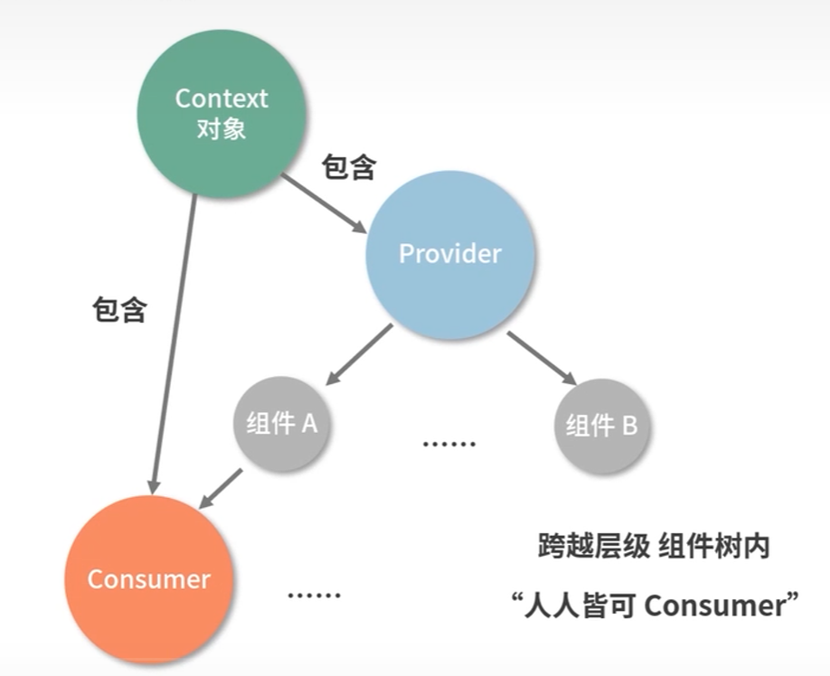

## react数据流动

### 基于Props的单向数据流

组件从概念上讲类似于JS函数，它接受任意入参并返回用于描述页面展示内容的React元素。单向数据流指的是当前组件的state以props形式流动时，只能流向在组件树中比自己层级低的组件。

### 利用发布-订阅模式驱动数据流

发布-订阅模式可以说是解决通信类问题的万金油。监听事件的位置和触发事件的位置是不受限的。

1. 发布-订阅模式的API设计思路
   
事件的监听和事件的触发

* on(): 负责注册事件的监听器，指定事件触发时的回调函数
* emit(): 负责触发事件，可以通过传参使其再触发的时候携带数据
* off(): 负责删除注册事件

2. 发布-订阅模式编码实现

```js
class EventEmitter {

    constructor(){
        // eventMap用来存储事件和监听函数之间的关系
        this.eventMap = {}
    }

    // type代表事件名称
    on(type,handler){
        if(! handler instanceof Function){
            throw new Error('handler必须是一个函数')
        }

        if(!this.eventMap[type]){
            this.eventMap[type] = [handler]
        }else{
            this.eventMap[type].push(handler)
        }
    }

    emit(type,params){
        if(this.eventMap[type]){
            this.eventMap[type].forEach((handler,index)=>{
                handler(params)
            })
        }
    }

    off(type,handler){
        if(this.eventMap[type]){
            this.eventMap[type].splice(this.eventMap[type].indexOf(handler),0,1)
        }
    }
}
```

### context API
context API是React官方提供的一种组件树通信模式。



#### React.createContext
```jsx
const AppContext = React.createContext(defaultValue)

const {Provider,Consumer} = AppContext

<Provider value={title: this.state.title}>
    <Title>
    <Content>
</Provider>
```

